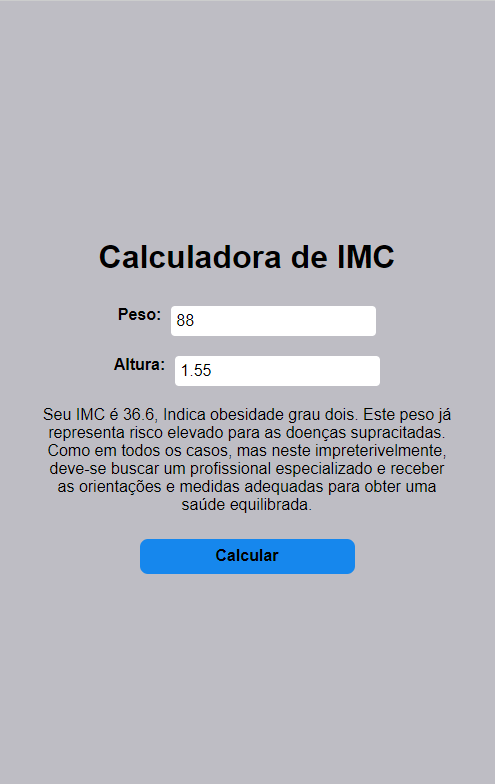
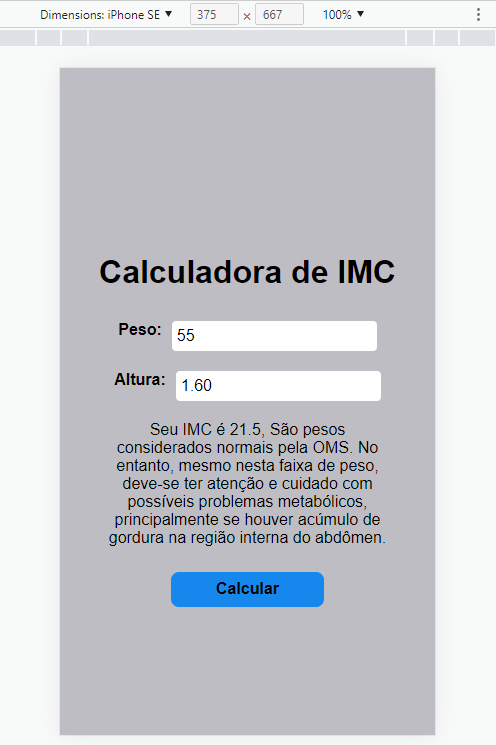

<h1 align="center">BMI calculator</h1>

<h1  align="center">

</h1>

<br>

[](https://github.com/Devrieff/Pokedex/blob/main/LICENSE)

<br>

## 📖 **Abount**

a very objective **BMI calculator**, where the user enters the data and returns his BMI situation. Fully responsive design.

<br>

## 🔨 **Tool**
- [JavaScript](https://developer.mozilla.org/pt-BR/docs/Web/JavaScript)
- [HTML5](https://developer.mozilla.org/en-US/docs/Glossary/HTML5)
- [Css3](https://developer.mozilla.org/pt-BR/docs/Web/CSS)

<br>

<h1 align="center">



</h1>


<br>

## ♻️ **How contribute**

```bash
#Clone the project
$ git clone 'https://github.com/gabriel-rieff/imc-calculator.git'
```
